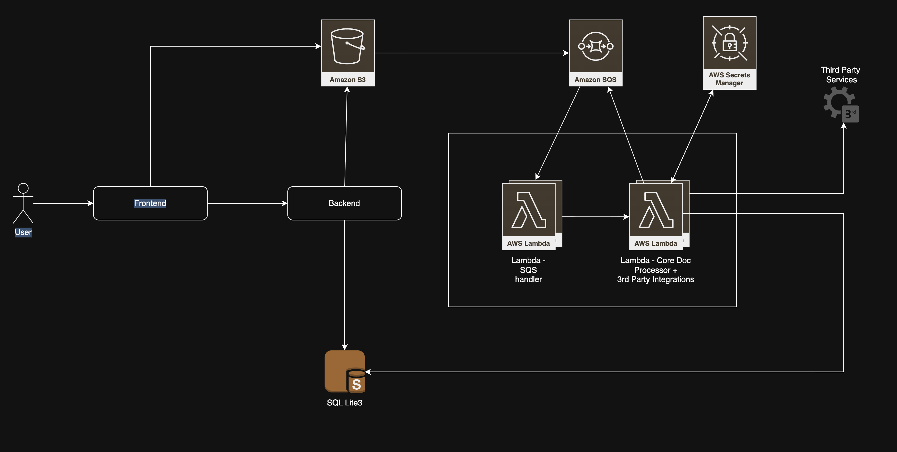
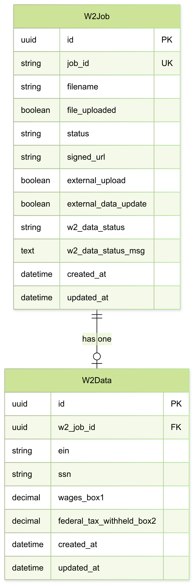

# Design - W2 Document Processor

# Synopsis

This project is created to demonstrate design and development of a scalable W2 Document processor using asynchronous services
 - to handle large volume of files, 
 - to extract information from the uploaded pdf files
 - to update the uploaded file and extracted results to mock 3rd party API services
 
> ⚠️ **Note:** Code is generated using AI due to time constraints. But I assure meticuluous care and detail put into every stage of design and code changes. 
## Architecture Diagram and Core Components


### Overview
This application is built using AWS services in mind. However, AWS is simulated using Localstack to run and test this application locally. Further configuration changes will be required to make it deployable in AWS. 

Refer [Readme.md](README.md) on how to run this locally. 

### Frontend
A simple frontend app built using Streamlit to demo the backend services.

1) Create a job by calling backend API
2) Signed S3 URL is provided by backend
3) Once user uploads pdf to signed url, event will be triggered to SQS

### Backend
Backend app is built using Django Rest frame work and has a core app - w2-job app
1) Backend interacts with AWS S3 

#### **Backend API Endpoints**

**1. Create Job**

This job will create a job and provide a signed url for the job to be used by frontend to upload file. 

Frontend is allowed to directly upload a file to S3 to prevent additional data transfer (ingress) to AWS service. 

```bash
curl -X POST http://localhost:8000/jobs/ \
  -H "Content-Type: application/json" \
  -d '{"filename": "w2-document.pdf"}'
```


**2. Get Job Details**

This service is used to get status and other updates on the current job. 

```bash
curl -X GET http://localhost:8000/jobs/{job_id}/
```

**3. Update Job (used by Lambda functions)**

This partial update API is to update various status and w2 data after extraction/error. 

```bash
curl -X PATCH http://localhost:8000/jobs/{job_id}/ \
  -H "Content-Type: application/json" \
  -d '{
    "file_uploaded": true,
    "status": "Success",
    "external_upload": true,
    "external_data_update": true,
    "w2_data_status": "success",
    "w2_data_status_msg": "Processing completed successfully",
    "w2_data": {
      "ein": "12-3456789",
      "ssn": "123-45-6789",
      "wages_box1": "50000.00",
      "federal_tax_withheld_box2": "7500.00"
    }
  }'
```


### SQLLite3 Database
Default Django Database. It's in-memory only and everytime server is stopped, data will be lost. 


### AWS Simple Queueing service (SQS)
Three types of events are inserted into AWS SQS
1) S3 upload
2) W2 - Extracted Data update 
3) W2 - External pdf upload

##  **Event Format for All 3 Events**

### **1. S3 Upload Event** (`s3_upload`)
```json
{
  "event_type": "s3_upload",
  "bucket_name": "w2-bucket",
  "object_key": "uploads/job-id-123/w2.pdf",
  "event_name": "s3:ObjectCreated:Put",
  "timestamp": "2024-01-01T00:00:00.000Z"
}
```

### **2. External Upload Event** (`external_upload`)
```json
{
  "event_type": "external_upload",
  "job_id": "job-id-123",
  "s3_url": "s3://w2-bucket/uploads/job-id-123/w2.pdf",
  "timestamp": "2024-01-01T00:00:00.000Z"
}
```

### **3. External Data Update Event** (`external_data_update`)
```json
{
  "event_type": "external_data_update",
  "job_id": "job-id-123",
  "w2_data": {
    "ein": "12-3456789",
    "ssn": "123-45-6789",
    "wages_box1": "50000.00",
    "federal_tax_withheld_box2": "7500.00"
  },
  "timestamp": "2024-01-01T00:00:00.000Z"
}
```

#### **Event Flow:**
1. **S3 Upload** → Triggers `s3_upload` event
2. **After W2 processing** → Publishes `external_upload` and `external_data_update` events
3. **All events** → Processed by `core-processor` Lambda based on `event_type`


### AWS Lambda Functions

 1. SQS Handler
	  - Processes messages in SQS asynchronously and invokes Core lambda processor. This could process multiple messages per second and fan out to make multiple requests to lambda processor
 2. Core Lambda Processor
	 Handles all 3 types of events and in case of any failures, SQS messages will be retried with exponential back off. 

Using SQS handler and Core Lambda processor decouples the systems and helps scaling up, when multiple requests are made. 

If event processing fails multiple times, it will be pushed to Dead Letter Queue (DLQ) 

### Third party services
Third party services are mocked using unitest.mock.patch (usually used for testing).

### AWS Secret Manager
AWS Secret manager is used to provide the secret key required for authentication with 3rd party service

### Docker 

All the dependencies and services are installed and setup using docker. 


### Custom setup scripts (For local run)
Custom scripts are required to be run to simulate AWS infrastructure dependencies in this project. 
1) Create S3 buckets 
2) Create SQS queue
3) Configure upload to S3 buckets to generate events to the created SQS queue
4) Deploy lambda functions
5) Map SQS queue to Lambda Event handler

## Process Flow Diagram

The following sequence diagram illustrates the complete W2 document processing workflow:


**Interactive Mermaid Chart:** [View and edit the sequence diagram online](https://www.mermaidchart.com/app/projects/190ea5b0-c8c5-4439-8509-8140f6dc659e/diagrams/bf4e2ecc-2dfe-42d2-9f05-cd87c0e81b27/version/v0.1/edit)

This diagram shows the complete flow from user upload through S3 events, SQS processing, Lambda functions, W2 data extraction, external API calls, and final status updates.